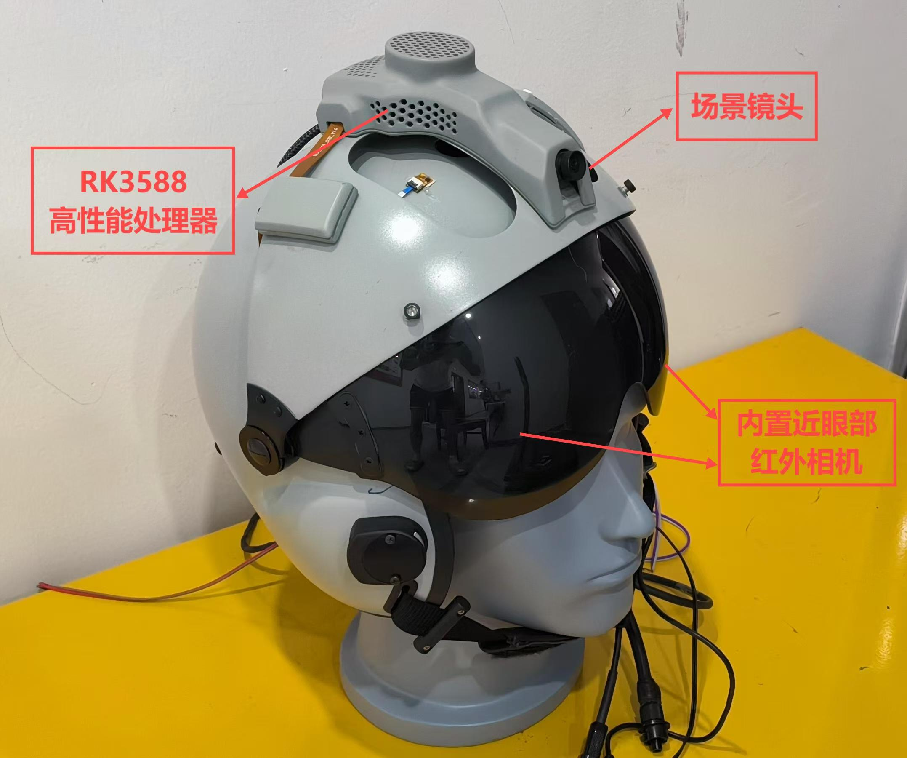

# PupilGaze

`PupilGaze` 是一个基于 C++、OpenCV 和 Ceres Solver 的双目眼动追踪与 Kappa 角标定项目。程序同时读取 1 路场景相机和 2 路眼部相机，利用 ArUco 标定板估计屏幕位姿，结合瞳孔检测与 3D 眼球模型重建，完成 Kappa 角标定与凝视点估计。

项目路线：先建立左右眼球模型，再采集 Kappa 标定数据，计算 Kappa 角，最后进入双目凝视点估计。

## 部署平台



## 功能概览

- 三路视频采集：场景相机、左眼相机、右眼相机
- 2D/3D 瞳孔检测与单眼 3D 眼球模型重建
- ELLSeg 轻量化眼部特征提取：分割图、latent 特征、瞳孔/虹膜椭圆
- 基于 ArUco GridBoard 的场景坐标系姿态估计
- Kappa 角采集、CSV 保存与均值计算
- 双目视线交会的凝视点估计
- 标定/评估数据和视频的本地保存

## 核心流程

程序入口在 `main.cpp`，整体由状态机驱动：

1. `INIT`
   读取 `calibration_file.yml`，初始化场景相机和左右眼相机参数。
2. `RUNNING`
   实时显示右眼、左眼、场景三路画面，并等待键盘输入。
3. `EYE_MODEL`
   对左右眼图像做瞳孔检测，重建 3D 眼球模型；如果已加载 ELLSeg TorchScript 模型，则同步提取眼部分割、latent 和椭圆特征。
4. `CALIBRATE_KAPPA`
   在已知参考凝视点下采集眼球中心、瞳孔中心和真实凝视点，保存到 CSV。
5. `CALCULATE_KAPPA`
   读取采集数据，计算左右眼 Kappa 角平均值并输出结果。
6. `ESTIMATE_GAZE_POINT`
   加载 Kappa 角，构造左右眼视轴，计算双目视线最近点的中点作为凝视点。
7. `EXIT`
   释放相机与窗口资源。

## 键盘操作

主界面 `RUNNING` 状态下：

- `r`：重建左右眼球模型
- `c`：进入 Kappa 标定数据采集
- `k`：计算 Kappa 角
- `e`：进入凝视点估计
- `q`：退出程序

在 `CALIBRATE_KAPPA` 或 `ESTIMATE_GAZE_POINT` 状态下：

- `1` `2` `3` `4`：选择 `gaze_point_sequence` 中的 4 个参考点
- `s`：保存当前采集数据
- `f`：返回主界面

## 目录结构

```text
PupilGaze/
├── CMakeLists.txt
├── calibration_file.yml
├── main.cpp
├── include/
│   ├── ellseg_feature.h / ellseg_feature.cpp
│   ├── geometry.h / geometry.cpp
│   ├── state.h / state.cpp
│   └── tool.hpp
├── EllSeg/
│   ├── export_libtorch.py
│   ├── models/
│   └── weights/
├── src/
│   ├── api/
│   │   ├── gazeTracingM.h
│   │   └── gazeTrackingM.cpp
│   ├── shared_cpp/
│   │   └── include/
│   └── shared_modules/
│       ├── calibration/
│       └── pupil_detectors/
├── data/
│   ├── gazePoint/
│   └── kappaAngle/
├── output/
└── results/
```

## 代码模块说明

### `main.cpp`

程序入口，负责状态机调度。

### `include/state.h` / `include/state.cpp`

- 封装 `Camera`
- 定义 `GeometryEyeModel`
- 实现初始化、运行、模型重建、Kappa 标定、凝视估计、退出等状态
- 在 `EYE_MODEL` 状态下可选调用 ELLSeg 特征提取器

### `include/geometry.h` / `include/geometry.cpp`

- 3D 点、向量、直线等几何结构
- Kappa 角计算与 CSV 读写
- ArUco 标定板检测
- 单目线面求交与双目视线最短连线中点求凝视点

### `include/ellseg_feature.h` / `include/ellseg_feature.cpp`

ELLSeg 的 C++ 接入层，负责加载由 `EllSeg/export_libtorch.py` 导出的 TorchScript 模型，并从单帧眼部图像中提取：

- `segmentation`：恢复到原始眼图尺寸的语义分割标签图
- `latent_feature`：ELLSeg 编码器输出的轻量化特征
- `ellipse_regression`：ELLSeg 椭圆回归头输出的原始参数
- `pupil` / `iris`：基于分割区域拟合得到的瞳孔和虹膜椭圆
- `overlay`：分割图和椭圆叠加后的可视化结果

当前主流程仍保留原有 `CGazeTrakingM` 的 3D 眼球模型重建逻辑，ELLSeg 作为可选特征提取模块接入，后续可继续替换或融合原有瞳孔检测输入。

### `src/api/`

`CGazeTrakingM` 眼动跟踪接口，串联瞳孔检测、3D 眼球模型和在线标定逻辑。

### `src/shared_modules/pupil_detectors/`

包含 2D 瞳孔检测器、眨眼检测和 `singleeyefitter` 相关代码，是眼球建模与 3D 瞳孔恢复的核心模块。

### `src/shared_modules/calibration/`

包含 bundle adjustment、平面/直线几何辅助函数等标定相关代码。

## 标定文件说明

`calibration_file.yml` 中至少包含以下内容：

- 场景相机内参和畸变参数
- 左右眼相机内参和畸变参数
- 左右眼相机到场景相机的旋转和平移
- 三个相机的设备 ID
- `gaze_point_sequence`

当前仓库中的示例 `gaze_point_sequence` 为 4 个三维点，单位是毫米，位于标定板坐标系中。

需要注意：

- 示例配置里 `eye_camera_right_id` 和 `eye_camera_left_id` 都是 `6`，这通常只是临时配置，实际使用时需要改成真实设备编号。
- 程序按相对路径读取 `../calibration_file.yml`，因此推荐从构建目录运行可执行文件。

## ArUco 标定板

根据 `include/geometry.cpp` 当前实现，程序使用：

- `cv::aruco::DICT_4X4_50`
- `2 x 2` 的 `GridBoard`
- 单个 marker 边长 `82.34375 mm`
- marker 间距 `32.9375 mm`

如果你自己制作标定板，物理尺寸和字典需要与代码保持一致。

## 构建依赖

从源码可以直接确认项目依赖以下组件：

- C++17 编译器
- Boost
- OpenCV
- Ceres Solver
- Eigen
- glog / gflags
- LibTorch（可选，用于启用 ELLSeg C++ 推理）

从仓库中历史 `build/` 链接信息可以推断，这个项目曾在以下组合上构建过：

- OpenCV `4.5.1`
- Ceres Solver `1.14.0`

这是从现有构建产物反推得到的历史环境，不代表当前仓库已经在本机重新验证通过。

## Ubuntu 构建示例

```bash
sudo apt update
sudo apt install -y \
  build-essential cmake pkg-config v4l-utils \
  libboost-all-dev \
  libopencv-dev \
  libceres-dev \
  libeigen3-dev \
  libgoogle-glog-dev \
  libgflags-dev
```

```bash
cmake -S . -B build
cmake --build build -j
```

如果需要启用 ELLSeg 的 C++ 推理，需要额外安装或解压 LibTorch，并在 CMake 配置时提供 `Torch_DIR`。例如：

```bash
cmake -S . -B build -DTorch_DIR=/path/to/libtorch/share/cmake/Torch
cmake --build build -j
```

如果 CMake 没有找到 LibTorch，项目仍会构建 `EllSegFeatureExtractor` 的同名接口，但不会执行实际 ELLSeg 推理。

## ELLSeg 模型导出与接入

ELLSeg 代码位于 `EllSeg/` 目录。C++ 侧不直接加载 Python 权重文件，而是加载 `export_libtorch.py` 导出的 TorchScript 模型。

导出示例：

```bash
cd EllSeg
python export_libtorch.py \
  --command export \
  --weights ./weights/all.git_ok \
  --output ./weights/ellseg_ritnet_v3.pt
```

导出的默认模型路径为：

```text
EllSeg/weights/ellseg_ritnet_v3.pt
```

`main.cpp` 默认按相对路径 `../EllSeg/weights/ellseg_ritnet_v3.pt` 查找该模型。因此推荐从 `build/` 目录运行可执行文件；如果模型文件存在且工程启用了 LibTorch，程序会在启动时尝试加载 ELLSeg。

ELLSeg 导出的 TorchScript 包装层输入为单通道眼图张量：

```text
[1, 1, 240, 320]
```

C++ 侧 `EllSegFeatureExtractor` 会自动完成灰度转换、宽度对齐、居中补边/裁剪和均值方差归一化，并将模型输出的分割图恢复到原始眼图尺寸。

## 运行方式

首次运行前建议先创建输出目录：

```bash
mkdir -p data/gazePoint data/kappaAngle output results
```

然后从构建目录启动：

```bash
cd build
./KappaCalibrate
```

## 数据输出

程序当前会向以下位置写入数据：

- `data/kappaAngle/gaze_point_*.csv`
  Kappa 标定采集数据
- `results/kappa_result.csv`
  计算得到的左右眼 Kappa 角
- `data/gazePoint/gaze_point_*.csv`
  凝视点估计阶段保存的数据
- `output/scene_video.avi`
- `output/right_eye_video.avi`
- `output/left_eye_video.avi`

## 演示视频

<video src="assets/demo.mp4" controls width="960">
  你的 Markdown 查看器如果不支持内嵌视频，可直接打开下方链接观看。
</video>

[点击查看演示视频](assets/demo.mp4)
